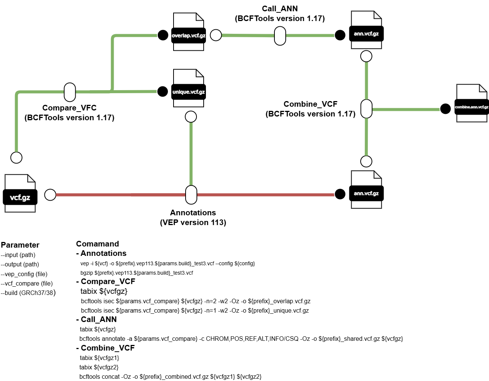

# nextflow-vep

## หัวข้อ
1. บทนำ
2. การใช้งาน nextflow-vep
3. การเตรียมเครื่องมือและข้อมูลสำหรับ nextflow-vep
4. รายละเอียดขั้นตอนใน nextflow-vep
5. การปรับแต่งการ Annotations ใน VEP
6. Output

---

## 1. บทนำ
nextflow-vep เป็น bioinformatics pipline ที่พัฒนาขึ้นสำหรับการทำ Variant Annotations โดยจะมีขั้นตอนดังต่อไปนี้ 
1. การทำ Variant Annotations
2. การทำเปรียบเทียบข้อมูล Variant ที่ซ้ำกับข้อมูล Variant ที่มีอยู่ (Comapare_VCF) 
3. การดึงข้อมูล Variant Annotations จากข้อมูล Variant ที่มีอยู่ (Call_ANN)
4. การรวมไฟล์ (Combine_VCF)
   


## 2. การใช้งาน nextflow-vep
### การใช้งานแบบไม่ใช้ขั้นตอน Comapare_VCF 
ผู้ใช้งานสามารถใช้คำสั่งต่อไปนี้ในการสั่งใช้งาน โดยข้อมูลที่อยู่ใน data จะต้องอยู่ในรูป vcf.gz โดย workflow การทำงานจะเป็นไปตามเส้นแดง

```bash
nextflow run main.nf -profile gb --input data --outdir results
```

### การใช้งานแบบใช้ขั้นตอน Compare_VCF 
ผู้ใช้งานสามารถใช้ option –-vcf_compare ในการระบุเส้นทางของไฟล์ VCF ที่จะใช้ในการเปรียบเทียบ โดย workflow การทำงานจะเป็นไปตามเส้นเขียว

```bash
nextflow run main.nf -profile gb --input data --vcf_compare <path>/{compare}.vcf.gz --outdir results
```
### การใช้งานแบบทำซ้ำ 
ในการทำงานของ nextflow-vep บางครั้งอาจจะเกิดข้อผิดพลาดในบาง process ทำให้ nextflow-vep หยุดการทำงานไป ผู้ใช้งานสามารถเปิดใช้งาน option -resume ในการรัน nextflow-vep ซ้ำได้ โดยหากเปิดใช้ option นี้จะทำให้ nextflow-vep รันแค่เฉพาะ process ที่ errors และเก็บขอมูล process ที่รันผ่านแล้ว ทำใหม่ต้องรัน process ใหม่ทั้งหมด

```bash
nextflow run main.nf -profile gb --input data --vcf_compare <path>/{compare}.vcf.gz --outdir results -resume
```


## 3. การเตรียมเครื่องมือและข้อมูลสำหรับ nextflow-vep
### เครืองมือ 
1. Nextflow: version 24 
2. Variant Annotations: VEP version 113
3. Comapare_VCF: BCFTools version 1.17
4. Call_ANN: BCFtools version 1.17
5. Combine_VEP: BCFTools version 1.17

### การปรับแต่ง Config
โดยผู้ใช้งานสามารปรับแต่ง Config ในไฟล์ gb.config ให้เหมาะสมกับทรัพยากรในเครื่องโดย gb.config จะทำงานรวมกับ nextflow.config โดยใช้ตัวเลือก -profile เพื่อเลือก config ที่จะใช้งาน
```bash
process {
  executor = 'slurm'
  queue = 'memory'
  cache = 'lenient'


  withName: ANN_VEP {
  container = '/nbt_main/share/apps/singularity_apps/vep113.sif'
  module = 'BCFtools/1.17-GCC-12.2.0'
  cpus = 16
  memory = '32 GB'

  }

  withName: Compare_vcf {
  module = 'BCFtools/1.17-GCC-12.2.0'
  cpus = 4
  memory = '8 GB'
  }

  withName: Combine_VCF {
  module = 'BCFtools/1.17-GCC-12.2.0'
  cpus = 4
  memory = '8 GB'
  }

  withName: Call_ANN {
  module = 'BCFtools/1.17-GCC-12.2.0'
  cpus = 4
  memory = '8 GB'
  }

}

singularity {
    enabled = true
    autoMounts = true
    runOptions = "--bind <path>/vep_bundle"
}
```

### การเตรียมโฟลเดอร์สำหรับ VEP
ผู้ใช้งานจำเป็นที่จะต้องเตรียมโฟลเดอร์สำหรับการรันโปรแกรม VEP ไว้ในโฟลเดอร์ vep_bundle หรือจะกำหนดเส้นทางของโฟลเดอร์นี้ลงในตัวแปล runOptions = “--bind <path>” โดยในโฟลเดอร์นี้จะต้องประกอบไปด้วยไฟล์จริงของข้อมูลที่จะใช้เช่น เส้นทางโปรแกรม VEP, ไฟล์ FASTA, ไฟล์ Plugin เป็นต้น โดยรายละเอียดการเตรียมโฟลเดอร์ [สามารถศึกษาเพิ่มเติมได้ที่ VEP](
https://useast.ensembl.org/info/docs/tools/vep/script/index.html)
```bash
vep_bundle
├── dbNSFP4.9
│    ├── dbNSFP4.9a_grch38.gz
│    └── dbNSFP4.9a_grch38.gz.tbi
├── fasta
│    ├── resources-broad-hg38-v0-Homo_sapiens_assembly38.fasta.gz
│    ├── resources-broad-hg38-v0-Homo_sapiens_assembly38.fasta.gz.fai       
│    └── resources-broad-hg38-v0-Homo_sapiens_assembly38.fasta.gz.gzi
├── dbscSNV
│    ├── dbscSNV1.1_GRCh38.txt.gz
│    └── dbscSNV1.1_GRCh38.txt.gz.tbi
└── homo_sapiens_refseq
     └── 113_GRCh38
```


## 4. รายละเอียดขั้นตอนใน nextflow-vep
### การทำ Variant Annotations	
สำหรับเครื่องมือชีวสารสนเทศที่ใช้ในขั้นตอนการทำ Variant Annotations ได้แก่ VEP (version 113) ทำการ Annotations ตามข้อมูลใน vep_config (สามารถดูรายละเอียดได้ในหัวข้อที่ 2)
### การทำเปรียบเทียบข้อมูล Variant ที่ซ้ำกับข้อมูล Variant ที่มีอยู่ (Comapare_VCF)
สำหรับเครื่องมือชีวสารสนเทศที่ใช้ในขั้นตอนการทำ Compare_VCF ได้แก่ BCFTools (version 1.17) โดยใช้ bcftools isec ในการดึงข้อมูล Variants ที่ซ้ำกับ vcf_compare ไว้ในไฟล์ overlap.vcf.gz และดึงข้อมูล Variants ที่ไม่ซ้ำ vcf_compare ไว้ในไฟล์ unique.vcf.gz โดยเกณฑ์ในการดึงข้อมูลที่ซ้ำกันคือจะต้องมีตำแหน่งที่ตรงกันและมี ALT กับ REF ที่เหมือนกัน
### การดึงข้อมูล Variant Annotations จากข้อมูล Variant ที่มีอยู่ (Call_ANN)
สำหรับเครื่องมือชีวสารสนเทศที่ใช้ในขั้นตอนการทำ Call_ANN ได้แก่ BCFTools (version 1.17) โดยใช้ bcftools annotate ในการดึงข้อมูล Annotations ของ variants ใน vcf_compare ที่ซ้ำกับข้อมูลใน overlap.vcf.gz จากในขั้นตอน 2.3 มาใส่ให้ overlap.vcf.gz โดยจะทำการเลือก tag “CSQ” ในคอลัมน์ INFO ที่จะมีการบันทึกข้อมูล Annotations มาใส่ให้กับ variants ที่ซ้ำกับ vcf_compare แต่ยังไม่มีข้อมูล Annotations
### การรวมไฟล์ (Combine_VCF)
สำหรับเครื่องมือชีวสารสนเทศที่ใช้ในขั้นตอนการทำ Combine_VCF ได้แก่ BCFTools (version 1.17) ทำการรวมไฟล์โดยใช้คำสั่ง bcftools concat ในการรวมข้อมูลจากที่ทำการดึงข้อมูล Annotaions ในขั้นตอน 2.3 และไฟล์ที่ทำการ Varinats Annotations ในขั้นตอนการทำ Variant Annotations ให้เป็นไฟล์เดียวกัน


## 5. การปรับแต่งการ Annotations ใน VEP
ในการรัน VEP คำสั่งและรายละเอียด option การทำงานจะอยู่ในไฟล์ VEP_GRCh38.ini โดยผู้ใช้งานสามารถแก้ไขข้อมูลที่ต้องการปรับแต่งในการ Annotations ในไฟล์นี้ 
```bash
#data basse
refseq 1
dir /nbt_main/home/lattapol/nextflow-vep2/vep_bundle

#reference
fasta /nbt_main/home/lattapol/nextflow-vep2/vep_bundle/fasta/resources-broad-hg38-v0-Homo_sapiens_assembly38.fasta.gz

#options
species homo_sapiens
assembly 'GRCh38'
force_overwrite 1
offline 1
everything 1
vcf 1
fork 32

#plugin
plugin dbNSFP,/nbt_main/home/lattapol/nextflow-vep2/vep_bundle/dbNSFP4.9/dbNSFP4.9a_grch38.gz,ALL 
```         


โดยรายการปรับแต่งในกรณีที่จะทำการเปิดงานใช้ option นั้นในให้ใส่ 1 เช่น “offline 1” (หากเป็นการใช้งานปกติจะเป็น --offline) ในกรณีที่จะใส่รายละเอียดใน option เช่น “species homo_sepiens”สามรถใช้งานได้เหมือนปกติ โดยผู้ใช้งานสามารถศึกษา options ในการทำงานเพื่อให้เหมาะสมกับข้อมูลที่ใช้ในการ Annotations [เพิ่มเติมได้ที่ VEP](https://useast.ensembl.org/info/docs/tools/vep/script/index.html)

## 6. Output
โดยผลลัพธ์การ Annotations จะอยู่ในรูปแบบของไฟล์ {samples}.vep113. GRCh38.vcf.gz ซึ่งข้อมูลที่ได้มาจากการ Annotations จะอยู่ภายใต้ fields ที่ชื่อ CSQ และข้อมูลจะถูกแบ่งด้วย | ตามรูปที่ 10 และ VEP ยังมีการสรุปข้อมูลการ Annotations ในไฟล์ {samples}_summary.html นอกจากนี้ยังมีไฟล์ {samples}_warnings.txt ในกรณีที่มีการแจ้งเตือนจาก VEP
```bash
output
├── Call_ANN
│    ├── {samples}_overlap_shared.vcf.gz
├── Combine_VCF
│    ├── {samples}_combine.vcf.gz
├── Compare_results
│    ├── {samples}_overlap.vcf.gz
│    └── {samples}_unique.vcf.gz
└── VEP_results
     ├── {samples}_vep113.GRCh38.vcf.gz 
     ├── {samples}_summary.html       
     └── {samples}_warnings.txt
```

