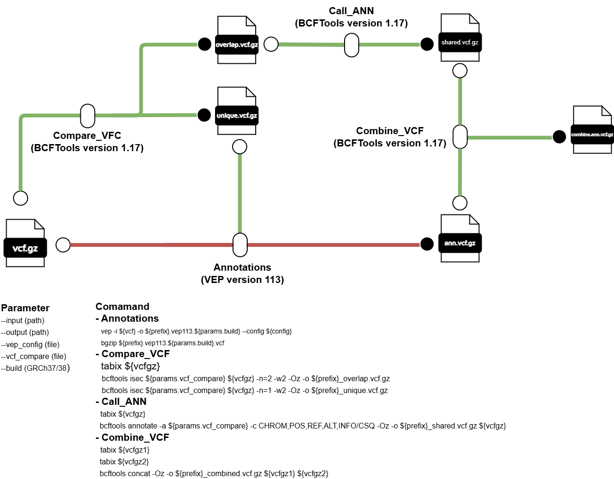

# nextflow-vep

## หัวข้อ
1. [บทนำ](#1-บทนำ)
2. [การใช้งาน nextflow-vep](#2-การใช้งาน-nextflow-vep)
3. [การเตรียมเครื่องมือและข้อมูลสำหรับ nextflow-vep](#3-การเตรียมเครื่องมือและข้อมูลสำหรับ-nextflow-vep)
4. [รายละเอียดขั้นตอนใน nextflow-vep](#4-รายละเอียดขั้นตอนใน-nextflow-vep)
5. [การปรับแต่งการ Annotations ใน VEP](#5-การปรับแต่งการ-Annotations-ใน-VEP)
6. [Output](#6-Output)

---

## 1. บทนำ
nextflow-vep เป็น bioinformatics pipline ที่พัฒนาขึ้นสำหรับการทำ Variant Annotations โดยจะมีขั้นตอนดังต่อไปนี้ 
1. การทำ Variant Annotations
2. การเปรียบเทียบข้อมูล Variant ที่ซ้ำกับข้อมูล Variant ที่มีอยู่ (Comapare_VCF) 
3. การดึงข้อมูล Variant Annotations ที่ซ้ำกับข้อมูล Variant ที่มีอยู่ (Call_ANN)
4. การรวมไฟล์ (Combine_VCF)
   


## 2. การใช้งาน nextflow-vep
### การใช้งานแบบไม่ใช้ขั้นตอน Comapare_VCF 
ผู้ใช้งานสามารถใช้คำสั่งต่อไปนี้ในการสั่งใช้งาน nextflow-vep โดยข้อมูลที่อยู่ใน data จะต้องอยู่ในรูป vcf.gz โดย workflow [การทำงานจะเป็นไปตามเส้นแดง](#nextflow-vep.drawio.png)

```bash
nextflow run main.nf -profile gb --input data --outdir results
```

### การใช้งานแบบใช้ขั้นตอน Compare_VCF 
ผู้ใช้งานสามารถใช้ option –-vcf_compare ในการระบุเส้นทางของไฟล์ VCF ที่จะใช้ในการเปรียบเทียบ โดย workflow การทำงานจะเป็นไปตามเส้นเขียว

```bash
nextflow run main.nf -profile gb --input data --vcf_compare <path>/{compare}.vcf.gz --outdir results
```
### การใช้งานแบบทำซ้ำ 
ในการทำงานของ nextflow-vep บางครั้งอาจจะเกิดข้อผิดพลาดในบาง process ทำให้ nextflow-vep หยุดการทำงานไป ผู้ใช้งานสามารถเปิดใช้งาน option `-resume` ในการรัน nextflow-vep ซ้ำได้ โดยหากเปิดใช้ option นี้จะทำให้ nextflow-vep รันแค่เฉพาะ process ที่ errors และเก็บขอมูล process ที่รันผ่านแล้ว ทำใหม่ต้องรัน process ใหม่ทั้งหมด

```bash
nextflow run main.nf -profile gb --input data --vcf_compare <path>/{compare}.vcf.gz --outdir results -resume
```
### Options
- `--build` = build genome มีผลกับชื่อ output (จำเป็น:ค่าเริ่มต้น:“GRCh38”)
- `--input` = โฟลเดอร์ input (จำเป็น:ค่าเริ่มต้น:data)
- `--outdir` = โฟล์เดอร์ output (จำเป็น:ค่าเริ่มต้น:output)
- `--vep_config` = เส้นทาง VEP_GRCh38.ini (จำเป็น:ค่าเริ่มต้น:bin/VEP_GRCh38.ini)
- `--vcf_compare` = เส้นทางไฟล์ VCF ในการเปรียบเทียบในขั้นตอน VCF (ไม่จำเป็น)
- `-profile`  = เลือกไฟล์ config ในการรัน Nextflow


## 3. การเตรียมเครื่องมือและข้อมูลสำหรับ nextflow-vep
### เครืองมือ 
1. Nextflow: version 24 
2. Variant Annotations: VEP version 113
3. Comapare_VCF: BCFTools version 1.17
4. Call_ANN: BCFtools version 1.17
5. Combine_VEP: BCFTools version 1.17

### การปรับแต่ง Config
โดยผู้ใช้งานสามารปรับแต่ง Config ในไฟล์ gb.config ให้เหมาะสมกับทรัพยากรในเครื่องโดย gb.config จะทำงานรวมกับ nextflow.config โดยใช้ตัวเลือก `-profile` เพื่อเลือก config ที่จะใช้งาน
```bash
process {
  executor = 'slurm'
  queue = 'memory'
  cache = 'lenient'


  withName: ANN_VEP {
  container = '/nbt_main/share/apps/singularity_apps/vep113.sif'
  module = 'BCFtools/1.17-GCC-12.2.0'
  cpus = 16
  memory = '32 GB'

  }

  withName: Compare_vcf {
  module = 'BCFtools/1.17-GCC-12.2.0'
  cpus = 4
  memory = '8 GB'
  }

  withName: Combine_VCF {
  module = 'BCFtools/1.17-GCC-12.2.0'
  cpus = 4
  memory = '8 GB'
  }

  withName: Call_ANN {
  module = 'BCFtools/1.17-GCC-12.2.0'
  cpus = 4
  memory = '8 GB'
  }

}

singularity {
    enabled = true
    autoMounts = true
    runOptions = "--bind <path>/vep_bundle"
}
```

### การเตรียมโฟลเดอร์สำหรับ VEP
ผู้ใช้งานจำเป็นที่จะต้องเตรียมโฟลเดอร์สำหรับการรันโปรแกรม VEP ไว้ในโฟลเดอร์ vep_bundle หรือจะกำหนดเส้นทางของโฟลเดอร์นี้ลงในตัวแปล runOptions = `--bind <path>` โดยในโฟลเดอร์นี้จะต้องประกอบไปด้วยไฟล์จริงของข้อมูลที่จะใช้เช่น เส้นทางโปรแกรม VEP, ไฟล์ FASTA, ไฟล์ Plugin เป็นต้น โดยรายละเอียดการเตรียมโฟลเดอร์ 
[สามารถศึกษาเพิ่มเติมได้ที่ VEP](https://asia.ensembl.org/info/docs/tools/vep/script/index.html)
```bash
vep_bundle
├── dbNSFP4.9
│    ├── dbNSFP4.9a_grch38.gz
│    └── dbNSFP4.9a_grch38.gz.tbi
├── fasta
│    ├── resources-broad-hg38-v0-Homo_sapiens_assembly38.fasta.gz
│    ├── resources-broad-hg38-v0-Homo_sapiens_assembly38.fasta.gz.fai       
│    └── resources-broad-hg38-v0-Homo_sapiens_assembly38.fasta.gz.gzi
├── dbscSNV
│    ├── dbscSNV1.1_GRCh38.txt.gz
│    └── dbscSNV1.1_GRCh38.txt.gz.tbi
└── homo_sapiens_refseq
     └── 113_GRCh38
```


## 4. รายละเอียดขั้นตอนใน nextflow-vep
### การทำ Variant Annotations	
สำหรับเครื่องมือชีวสารสนเทศที่ใช้ในขั้นตอนการทำ Variant Annotations ได้แก่ VEP (version 113) ทำการ Annotations ตามข้อมูลใน vep_config [สามารถดูรายละเอียดได้ในหัวข้อที่ 5](#5-การปรับแต่งการ-Annotations-ใน-VEP)
```bash
process ANN_VEP {

  tag "${vcfgz}"
  publishDir "${params.outdir}/VEP_results"

  input:
  file(vcfgz)
  file(config)

  output:
  file("*")

  script:

  prefix=vcfgz.simpleName

  """
  vep -i ${vcfgz} -o ${prefix}.vep113.${params.build}.vcf --config ${config}
  bgzip ${prefix}.vep113.${params.build}.vcf
  """
}
```

### การทำเปรียบเทียบข้อมูล Variant ที่ซ้ำกับข้อมูล Variant ที่มีอยู่ (Comapare_VCF)
สำหรับเครื่องมือชีวสารสนเทศที่ใช้ในขั้นตอนการทำ Compare_VCF ได้แก่ BCFTools (version 1.17) โดยใช้ bcftools isec ในการดึงข้อมูล Variants ที่ซ้ำกับ `--vcf_compare` ไว้ในไฟล์ overlap.vcf.gz และดึงข้อมูล Variants ที่ไม่ซ้ำ `--vcf_compare` ไว้ในไฟล์ unique.vcf.gz โดยเกณฑ์ในการดึงข้อมูลที่ซ้ำกันคือจะต้องมีตำแหน่งที่ตรงกันและมี ALT กับ REF ที่เหมือนกัน
```bash
process Compare_vcf {

  tag { "${vcfgz}" }
  publishDir "${params.outdir}/Compare_results"

  input:
  file(vcfgz)

  output:
  file("${prefix}_overlap.vcf.gz")
  file("${prefix}_unique.vcf.gz")

  script:

  prefix=vcfgz.simpleName
  """
  tabix ${vcfgz}
  bcftools isec ${params.vcf_compare} ${vcfgz} -n=2 -w2 -Oz -o ${prefix}_overlap.vcf.gz
  bcftools isec ${params.vcf_compare} ${vcfgz} -n=1 -w2 -Oz -o ${prefix}_unique.vcf.gz

  """
}
```
### การดึงข้อมูล Variant Annotations จากข้อมูล Variant ที่มีอยู่ (Call_ANN)
สำหรับเครื่องมือชีวสารสนเทศที่ใช้ในขั้นตอนการทำ Call_ANN ได้แก่ BCFTools (version 1.17) โดยใช้ bcftools annotate ในการดึงข้อมูล Annotations ของ variants ใน vcf_compare ที่ซ้ำกับข้อมูลใน overlap.vcf.gz จากในขั้นตอน 2.3 มาใส่ให้ overlap.vcf.gz โดยจะทำการเลือก tag `CSQ` ในคอลัมน์ INFO ที่จะมีการบันทึกข้อมูล Annotations มาใส่ให้กับ variants ที่ซ้ำกับ vcf_compare แต่ยังไม่มีข้อมูล Annotations
```bash
process Call_ANN {

  tag "${vcfgz}"
  publishDir "${params.outdir}/Call_ANN"

  input:
  file(vcfgz)

  output:
  file("*.vcf.gz")

  script:

  prefix=vcfgz.simpleName

  """
  tabix ${vcfgz}
  bcftools annotate -a ${params.vcf_compare} -c CHROM,POS,REF,ALT,INFO/CSQ -Oz -o ${prefix}_shared.vcf.gz ${vcfgz}
  """
}
```
### การรวมไฟล์ (Combine_VCF)
สำหรับเครื่องมือชีวสารสนเทศที่ใช้ในขั้นตอนการทำ Combine_VCF ได้แก่ BCFTools (version 1.17) ทำการรวมไฟล์โดยใช้คำสั่ง bcftools concat ในการรวมข้อมูลจากที่ทำการดึงข้อมูล Annotaions ในขั้นตอน 2.3 และไฟล์ที่ทำการ Varinats Annotations ในขั้นตอนการทำ Variant Annotations ให้เป็นไฟล์เดียวกัน
```bash
process Combine_VCF {

  tag "${vcfgz}"
  publishDir "${params.outdir}/Combine_VCF"

  input:
  file(vcfgz1)
  file(vcfgz2)

  output:
  file("*vcf.gz")

  script:

  prefix=vcfgz1.simpleName

  """
  tabix ${vcfgz1}
  tabix ${vcfgz2}
  bcftools concat -Oz -o ${prefix}_combined.vcf.gz ${vcfgz1} ${vcfgz2}
  """
}
```
## 5. การปรับแต่งการ Annotations ใน VEP
ในการรัน VEP คำสั่งและรายละเอียด option การทำงานจะอยู่ในไฟล์ VEP_GRCh38.ini โดยผู้ใช้งานสามารถแก้ไขข้อมูลที่ต้องการปรับแต่งในการ Annotations ในไฟล์นี้ 
```bash
#data basse
refseq 1
dir /nbt_main/home/lattapol/nextflow-vep2/vep_bundle

#reference
fasta /nbt_main/home/lattapol/nextflow-vep2/vep_bundle/fasta/resources-broad-hg38-v0-Homo_sapiens_assembly38.fasta.gz

#options
species homo_sapiens
assembly 'GRCh38'
force_overwrite 1
offline 1
everything 1
vcf 1
fork 32

#plugin
plugin dbNSFP,/nbt_main/home/lattapol/nextflow-vep2/vep_bundle/dbNSFP4.9/dbNSFP4.9a_grch38.gz,ALL 
```         


โดยรายการปรับแต่งในกรณีที่จะทำการเปิดงานใช้ option นั้นในให้ใส่ 1 เช่น `offline 1` (หากเป็นการใช้งานปกติจะเป็น `--offline`) ในกรณีที่จะใส่รายละเอียดใน option เช่น “species homo_sepiens”สามรถใช้งานได้เหมือนปกติ โดยผู้ใช้งานสามารถศึกษา options ในการทำงานเพื่อให้เหมาะสมกับข้อมูลที่ใช้ในการ Annotations [เพิ่มเติมได้ที่ VEP](https://asia.ensembl.org/info/docs/tools/vep/script/index.html)

## 6. Output
โดยผลลัพธ์การ Annotations จะอยู่ในรูปแบบของไฟล์ {samples}.vep113. GRCh38.vcf.gz ซึ่งข้อมูลที่ได้มาจากการ Annotations จะอยู่ภายใต้ fields ที่ชื่อ CSQ และข้อมูลจะถูกแบ่งด้วย | ตามรูปที่ 10 และ VEP ยังมีการสรุปข้อมูลการ Annotations ในไฟล์ {samples}_summary.html นอกจากนี้ยังมีไฟล์ {samples}_warnings.txt ในกรณีที่มีการแจ้งเตือนจาก VEP
### ภาพรวม Output
```bash
output
├── Call_ANN
│    ├── {samples}_overlap_shared.vcf.gz
├── Combine_VCF
│    ├── {samples}_combine.vcf.gz
├── Compare_results
│    ├── {samples}_overlap.vcf.gz
│    └── {samples}_unique.vcf.gz
└── VEP_results
     ├── {samples}_vep113.GRCh38.vcf.gz 
     ├── {samples}_summary.html       
     └── {samples}_warnings.txt
```
### ตัวอย่างผลลัพธ์จาก {samples}_vep113.GRCh38.vcf.gz 
```bash
##fileformat=VCFv4.0
##VEP="v113.0" API="v113" time="2025-04-24 15:57:47" cache="/nbt_main/share/apps/vep_data_113/homo_sapiens_refseq/113_GRCh38" ensembl=113.58650ec ensembl-compara=113.d7a53c5 ensembl-funcgen=113.e30608c ensembl-io=113.bee6816 ensembl-variation=113.5a9059e 1000genomes="phase3" COSM
IC="99" ClinVar="202404" HGMD-PUBLIC="20204" assembly="GRCh38.p14" dbSNP="156" gencode="GENCODE 47" genebuild="GENCODE47" gnomADe="v4.1" gnomADg="v4.1" polyphen="2.2.3" refseq="GCF_000001405.40-RS_2023_10 - GCF_000001405.40_GRCh38.p14_genomic.gff" regbuild="1.0" sift="6.2.1"
##INFO=<ID=CSQ,Number=.,Type=String,Description="Consequence annotations from Ensembl VEP. Format: Allele|Consequence|IMPACT|SYMBOL|Gene|Feature_type|Feature|BIOTYPE|EXON|INTRON|HGVSc|HGVSp|cDNA_position|CDS_position|Protein_position|Amino_acids|Codons|Existing_variation|DISTANCE
|STRAND|FLAGS|VARIANT_CLASS|SYMBOL_SOURCE|HGNC_ID|CANONICAL|MANE|MANE_SELECT|MANE_PLUS_CLINICAL|TSL|APPRIS|CCDS|ENSP|SWISSPROT|TREMBL|UNIPARC|UNIPROT_ISOFORM|REFSEQ_MATCH|REFSEQ_OFFSET|GIVEN_REF|USED_REF|BAM_EDIT|GENE_PHENO|SIFT|PolyPhen|DOMAINS|miRNA|HGVS_OFFSET|AF|AFR_AF|AMR_AF
|EAS_AF|EUR_AF|SAS_AF|gnomADe_AF|gnomADe_AFR_AF|gnomADe_AMR_AF|gnomADe_ASJ_AF|gnomADe_EAS_AF|gnomADe_FIN_AF|gnomADe_MID_AF|gnomADe_NFE_AF|gnomADe_REMAINING_AF|gnomADe_SAS_AF|gnomADg_AF|gnomADg_AFR_AF|gnomADg_AMI_AF|gnomADg_AMR_AF|gnomADg_ASJ_AF|gnomADg_EAS_AF|gnomADg_FIN_AF|gnomA
Dg_MID_AF|gnomADg_NFE_AF|gnomADg_REMAINING_AF|gnomADg_SAS_AF|MAX_AF|MAX_AF_POPS|CLIN_SIG|SOMATIC|PHENO|PUBMED|MOTIF_NAME|MOTIF_POS|HIGH_INF_POS|MOTIF_SCORE_CHANGE|TRANSCRIPTION_FACTORS">
##VEP-command-line='vep --assembly GRCh38 --config VEP_GRCh38.ini --database 0 --dir [PATH]/vep_data_113/ --dir_plugins /plugins --everything --force_overwrite --fork 256 --input_file homo_sapiens_GRCh38.vcf --offline --output_file homo_sapiens_GRCh38.vep113.GRCh38_test3.vcf --re
fseq --vcf'
#CHROM  POS     ID      REF     ALT     QUAL    FILTER  INFO
22      17181903        rs7289170       A       G       .       .       CSQ=G|synonymous_variant|LOW|ADA2|51816|Transcript|NM_001282225.2|protein_coding|9/10||NM_001282225.2:c.1359T>C|NP_001269154.1:p.Tyr453%3D|1485|1359|453|Y|taT/taC|rs7289170&COSV52831455||-1||SNV|EntrezGene||Y
ES|MANE_Select|ENST00000399837.8|||||NP_001269154.1|||||||A|A||||||||0.1919|0.239|0.2003|0.0456|0.3211|0.1401|0.3095|0.2315|0.1586|0.2821|0.05166|0.3192|0.3208|0.3387|0.2932|0.1729|0.2792|0.2398|0.2259|0.2145|0.2752|0.05137|0.3338|0.2891|0.3352|0.2971|0.1641|0.3387|gnomADe_NFE|be
nign|0&1|1&1|25741868&24033266|||||,G|synonymous_variant|LOW|ADA2|51816|Transcript|NM_001282226.2|protein_coding|9/10||NM_001282226.2:c.1359T>C|NP_001269155.1:p.Tyr453%3D|1452|1359|453|Y|taT/taC|rs7289170&COSV52831455||-1||SNV|EntrezGene|||||||||NP_001269155.1|||||||A|A||||||||0.
1919|0.239|0.2003|0.0456|0.3211|0.1401|0.3095|0.2315|0.1586|0.2821|0.05166|0.3192|0.3208|0.3387|0.2932|0.1729|0.2792|0.2398|0.2259|0.2145|0.2752|0.05137|0.3338|0.2891|0.3352|0.2971|0.1641|0.3387|gnomADe_NFE|benign|0&1|1&1|25741868&24033266|||||,G|synonymous_variant|LOW|ADA2|51816
|Transcript|NM_001282227.2|protein_coding|9/10||NM_001282227.2:c.1233T>C|NP_001269156.1:p.Tyr411%3D|1402|1233|411|Y|taT/taC|rs7289170&COSV52831455||-1||SNV|EntrezGene|||||||||NP_001269156.1|||||||A|A||||||||0.1919|0.239|0.2003|0.0456|0.3211|0.1401|0.3095|0.2315|0.1586|0.2821|0.05
166|0.3192|0.3208|0.3387|0.2932|0.1729|0.2792|0.2398|0.2259|0.2145|0.2752|0.05137|0.3338|0.2891|0.3352|0.2971|0.1641|0.3387|gnomADe_NFE|benign|0&1|1&1|25741868&24033266|||||,G|synonymous_variant|LOW|ADA2|51816|Transcript|NM_001282228.2|protein_coding|9/10||NM_001282228.2:c.1233T>
C|NP_001269157.1:p.Tyr411%3D|1360|1233|411|Y|taT/taC|rs7289170&COSV52831455||-1||SNV|EntrezGene|||||||||NP_001269157.1|||||||A|A||||||||0.1919|0.239|0.2003|0.0456|0.3211|0.1401|0.3095|0.2315|0.1586|0.2821|0.05166|0.3192|0.3208|0.3387|0.2932|0.1729|0.2792|0.2398|0.2259|0.2145|0.27
52|0.05137|0.3338|0.2891|0.3352|0.2971|0.1641|0.3387|gnomADe_NFE|benign|0&1|1&1|25741868&24033266|||||,G|synonymous_variant|LOW|ADA2|51816|Transcript|NM_001282229.2|protein_coding|8/9||NM_001282229.2:c.999T>C|NP_001269158.1:p.Tyr333%3D|1117|999|333|Y|taT/taC|rs7289170&COSV5283145
5||-1||SNV|EntrezGene|||||||||NP_001269158.1|||||||A|A||||||||0.1919|0.239|0.2003|0.0456|0.3211|0.1401|0.3095|0.2315|0.1586|0.2821|0.05166|0.3192|0.3208|0.3387|0.2932|0.1729|0.2792|0.2398|0.2259|0.2145|0.2752|0.05137|0.3338|0.2891|0.3352|0.2971|0.1641|0.3387|gnomADe_NFE|benign|0&
1|1&1|25741868&24033266|||||,G|synonymous_variant|LOW|ADA2|51816|Transcript|NM_177405.3|protein_coding|6/7||NM_177405.3:c.636T>C|NP_803124.1:p.Tyr212%3D|713|636|212|Y|taT/taC|rs7289170&COSV52831455||-1||SNV|EntrezGene|||||||||NP_803124.1|||||||A|A||||||||0.1919|0.239|0.2003|0.045
6|0.3211|0.1401|0.3095|0.2315|0.1586|0.2821|0.05166|0.3192|0.3208|0.3387|0.2932|0.1729|0.2792|0.2398|0.2259|0.2145|0.2752|0.05137|0.3338|0.2891|0.3352|0.2971|0.1641|0.3387|gnomADe_NFE|benign|0&1|1&1|25741868&24033266|||||,G|synonymous_variant|LOW|ADA2|51816|Transcript|XM_01154613
3.3|protein_coding|9/10||XM_011546133.3:c.1359T>C|XP_011544435.1:p.Tyr453%3D|1527|1359|453|Y|taT/taC|rs7289170&COSV52831455||-1||SNV|EntrezGene|||||||||XP_011544435.1|||||||A|A||||||||0.1919|0.239|0.2003|0.0456|0.3211|0.1401|0.3095|0.2315|0.1586|0.2821|0.05166|0.3192|0.3208|0.338
7|0.2932|0.1729|0.2792|0.2398|0.2259|0.2145|0.2752|0.05137|0.3338|0.2891|0.3352|0.2971|0.1641|0.3387|gnomADe_NFE|benign|0&1|1&1|25741868&24033266|||||,G|synonymous_variant|LOW|ADA2|51816|Transcript|XM_047441407.1|protein_coding|8/9||XM_047441407.1:c.666T>C|XP_047297363.1:p.Tyr222
%3D|1073|666|222|Y|taT/taC|rs7289170&COSV52831455||-1||SNV|EntrezGene|||||||||XP_047297363.1|||||||A|A||||||||0.1919|0.239|0.2003|0.0456|0.3211|0.1401|0.3095|0.2315|0.1586|0.2821|0.05166|0.3192|0.3208|0.3387|0.2932|0.1729|0.2792|0.2398|0.2259|0.2145|0.2752|0.05137|0.3338|0.2891|0
.3352|0.2971|0.1641|0.3387|gnomADe_NFE|benign|0&1|1&1|25741868&24033266|||||
```
### ตัวอย่างผลลัพธ์จาก {samples}_summary.html


### ตัวอยาอย่างการเเจ้งเตือนจาก {samples}_warnings.txt
```bash
WARNING: 33515 : WARNING: Transcript-assembly mismatch in rs6650119
WARNING: Transcript-assembly mismatch in rs6650119
WARNING: 48514 : WARNING: Transcript-assembly mismatch in rs309472
WARNING: Transcript-assembly mismatch in rs309472
WARNING: 94004 : WARNING: Transcript-assembly mismatch in 1_52904690_C/T
WARNING: Transcript-assembly mismatch in 1_52904690_C/T
WARNING: 94023 : WARNING: Transcript-assembly mismatch in rs147654988
WARNING: Transcript-assembly mismatch in rs147654988
WARNING: Transcript-assembly mismatch in 1_52921616_C/T
WARNING: Transcript-assembly mismatch in 1_52921616_C/T
WARNING: 150607 : WARNING: Transcript-assembly mismatch in rs914616
WARNING: Transcript-assembly mismatch in rs914616

```
